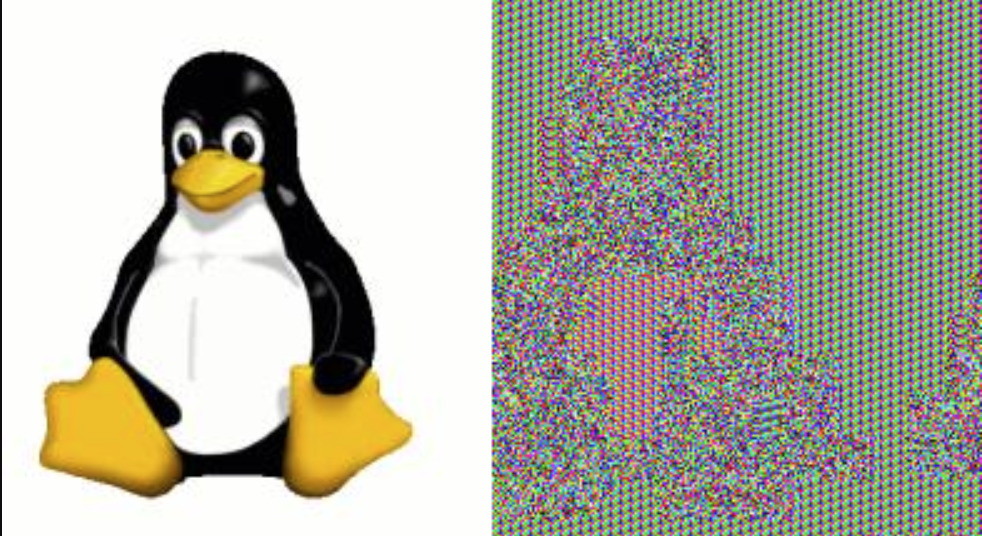

## File Encryption / Decryption

To see **ECB** mode patterns:
```bash
python3 src_python/file_enc_dec.py ECB Tux.bmp Tux2
python3 src_python/file_enc_dec.py --decrypt ECB Tux2 Tux_decrypted2.bmp
```


For a correct encryption:
```bash
python3 src_python/file_enc_dec.py CBC Tux.bmp Tux
python3 src_python/file_enc_dec.py --decrypt CBC Tux Tux_decrypted.bmp
```

